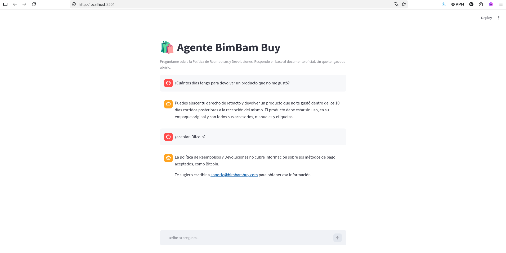
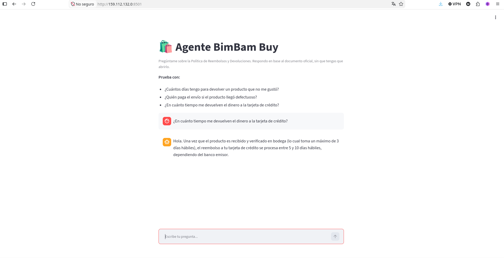

# 🛍️ Agente BimBam Buy — Challenge Alura

Agente de inteligencia artificial que responde en lenguaje natural preguntas sobre la **Política de Reembolsos y Devoluciones de BimBam Buy**, un e-commerce latinoamericano. Los colaboradores y clientes obtienen respuestas directas sin abrir el documento.

**Demo en OCI:** `http://159.112.132.0:8501`

## El problema

Los equipos de soporte pierden horas buscando plazos, condiciones y excepciones dentro de los documentos internos. Este agente lee la política oficial (PDF) y responde al instante cualquier consulta sobre devoluciones, reembolsos y cambios.

## Arquitectura de la solución

El agente usa **RAG (Retrieval-Augmented Generation)**:

```
                 ┌──────────────────────────────────────────────┐
                 │              FASE DE INDEXACIÓN              │
  PDF política ──► PyPDFLoader ──► TextSplitter ──► Embeddings ──► Índice FAISS
                 │                 (chunks 1000)    (Gemini)     │
                 └──────────────────────────────────────────────┘
                 ┌──────────────────────────────────────────────┐
                 │              FASE DE CONSULTA                │
  Pregunta ──────► Búsqueda semántica ──► Top-4 fragmentos ─┐   │
                 │        (FAISS)                            ▼   │
                 │                    Prompt + contexto ──► Gemini 2.5 Flash ──► Respuesta
                 └──────────────────────────────────────────────┘
```

1. **Ingesta**: `PyPDFLoader` lee el PDF y `RecursiveCharacterTextSplitter` lo divide en fragmentos de 1000 caracteres con superposición de 150.
2. **Indexación**: cada fragmento se convierte en un vector con `gemini-embedding-001` de Google (reducido a 768 dimensiones) y se guarda en un índice FAISS en memoria.
3. **Recuperación**: ante una pregunta, se buscan los 4 fragmentos semánticamente más cercanos.
4. **Generación**: **Gemini 2.5 Flash** redacta la respuesta usando solo ese contexto; si la información no está en el documento, lo dice honestamente.
5. **Interfaz**: una app de **Streamlit** con formato de chat, desplegada en **OCI Compute**.

## Tecnologías

| Herramienta | Rol |
|---|---|
| Python 3.10+ | Lenguaje principal |
| LangChain | Orquestación del pipeline RAG |
| PyPDF | Lectura del documento PDF |
| Google Gemini (API gratuita) | `gemini-embedding-001` (embeddings) + `gemini-2.5-flash` (generación) |
| FAISS | Búsqueda vectorial en memoria |
| Streamlit | Interfaz web de chat |
| OCI Compute (Always Free) | Deploy en la nube |

## Cómo ejecutar el proyecto

```bash
# 1. Clonar e instalar
git clone https://github.com/Marcoherna/bimbam-agente.git
cd bimbam-agente
python -m venv .venv && source .venv/bin/activate   # en Windows: .venv\Scripts\activate
pip install -r requirements.txt

# 2. Configurar la API key (gratis en https://aistudio.google.com/apikey)
export GOOGLE_API_KEY="tu_clave_aqui"               # en Windows: set GOOGLE_API_KEY=tu_clave_aqui
#    Copia .env.example como .env y coloca tu clave:
cp .env.example .env
#    Edita .env y pon: GOOGLE_API_KEY=tu_clave_aqui
#    El código carga el .env automáticamente con python-dotenv.

# 3a. Interfaz web
streamlit run app.py

# 3b. O modo consola
python src/agente.py
```
> Si prefieres no usar `.env`, también puedes exportar la variable en tu terminal:
> `export GOOGLE_API_KEY="tu_clave_aqui"` (en Windows: `set GOOGLE_API_KEY=tu_clave_aqui`).

Para el deploy en la nube, sigue la guía completa en [`docs/deploy_oci.md`](docs/deploy_oci.md).

## Ejemplos de preguntas y respuestas

**P: ¿Cuántos días tengo para devolver un producto si simplemente no me gustó?**
> Puedes ejercer tu derecho de retracto y devolver un producto que no te gustó dentro de los 10 días corridos posteriores a la recepción del mismo. El producto debe estar sin uso, en su empaque original y con todos sus accesorios, manuales y etiquetas.

**P: ¿En cuánto tiempo me devuelven el dinero a la tarjeta de crédito?**
> Una vez que el producto es recibido y verificado en bodega (máximo 3 días hábiles), el reembolso a tarjeta de crédito tarda entre 5 y 10 días hábiles según tu banco. Si prefieres, puedes recibirlo de inmediato como saldo en BimBam Wallet con un bono adicional del 10%.

**P: ¿Puedo devolver un traje de baño?**
> No, los trajes de baño y la ropa interior están dentro de los productos no elegibles para devolución según la política.

**P: ¿Cuál es el horario de atención por WhatsApp?**
> El WhatsApp de soporte (+56 9 5555 2024) atiende de lunes a sábado, de 9:00 a 21:00 horas.

**P: ¿Aceptan Bitcoin?**
> La política de Reembolsos y Devoluciones no cubre información sobre los métodos de pago aceptados, como Bitcoin. Te sugiero escribir a soporte@bimbambuy.com para obtener esa información.

*Nota: este caso demuestra que el agente no alucina — reconoce cuándo la información
está fuera del documento fuente y deriva al canal de soporte.*



## Estructura del repositorio

```
bimbam-agente/
├── app.py                 # Interfaz web (Streamlit)
├── listar_modelos.py      # Utilidad para ver los modelos disponibles en tu API key
├── src/
│   ├── __init__.py
│   └── agente.py          # Lógica RAG: carga, indexación y cadena de respuesta
├── data/
│   └── politica_reembolsos_bimbam_buy.pdf   # Documento fuente
├── docs/
│   ├── deploy_oci.md      # Guía de deploy en OCI paso a paso
│   └── capturas/          # Capturas del agente y del deploy
├── requirements.txt
├── .env.example
└── README.md
```

## Evidencia del deploy en OCI

La aplicación está desplegada y funcionando en una instancia OCI Compute (Always Free), accesible públicamente.

**Enlace público:** `http://159.112.132.0:8501`

